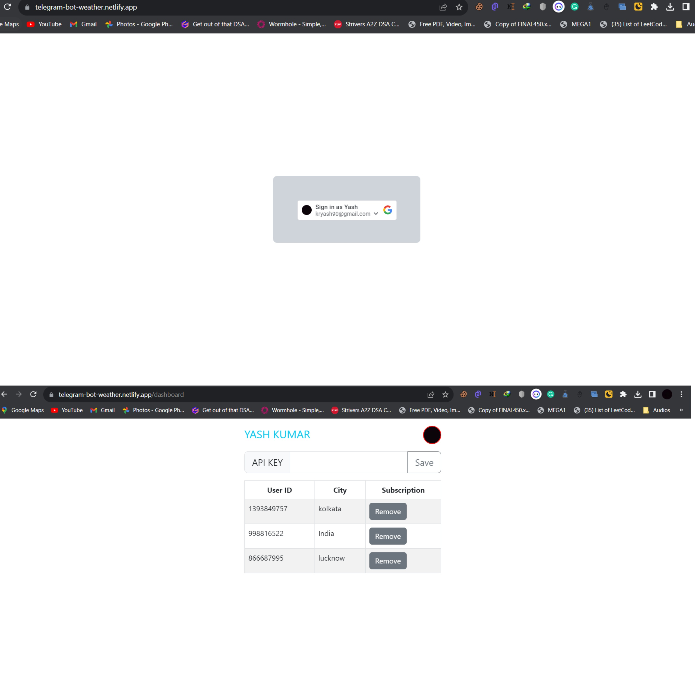

## Have a Look: [Bot-admin](https://telegram-bot-weather.netlify.app/) 

# Admin Page for Telegram Weather Update Bot

This project is the front-end admin page for the Telegram Weather Update Bot. It provides an interface for administrators to manage settings and perform administrative tasks for the bot.

## Here is the [Telegram Bot Implementation](https://github.com/yashkr90/telegram-bot)

## Features

- Admin login
- Dashboard to view bot statistics and important information.
- Page to configure bot settings API keys, add/remove users.

## Prerequisites

- Node.js installed on your machine.

## Installation

1. Clone the repository:

```shell
git clone https://github.com/keshavcodex/bot-admin
```

2. Navigate to the project directory:

```shell
cd admin-page
```

3. Install the dependencies:

```shell
npm install
```

## Usage

1. Start the development server:

```shell
npm start
```

2. Open your web browser and navigate to `http://localhost:3000`.

3. Login using your administrator credentials.

4. Explore the different pages of the admin panel to manage bot settings, user accounts, view statistics, and access logs.
